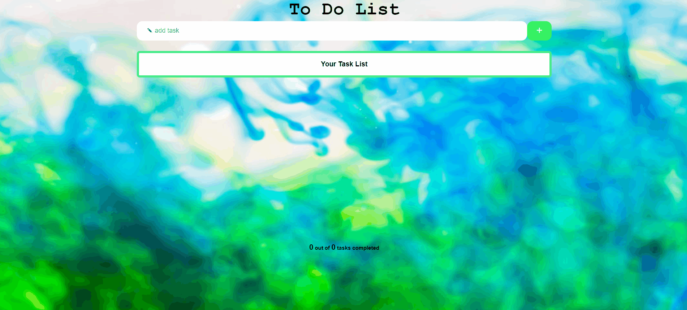

Elif's Space

## Project Name: To - Do App

## Description
Project aims to create a simple To-Do App.

## Learning Outcomes

At the end of the this project,

- analyze a problem, create a simple To-Do App.
   
## Problem Statement

- Your company has recently started on a project that aims to create a simple To-Do App. So you and your colleagues have started to work on the project.
- User should create, delete  and mark tasks as them done or undone

## Expected Outcome

### At the end of the project, following topics are to be covered;

- HTML 
- CSS
- JS

  Happy Ending  ✍ 

